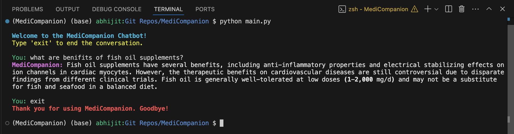

# Medicompanion RAG Application

🌟 Welcome to the Medicompanion Chatbot! 🤖💊 This RAG application leverages LangChain, Ollama, and the LLaMA 3.2 model to revolutionize healthcare conversations. Experience intelligent, engaging interactions designed to assist users with information related to fitness and health supplements.. Dive in! 🚀

## Directory Structure

```
.
├── README.md               # Documentation for the project
├── chat_model.py           # Implementation of the chat model
├── config.py               # Configuration settings for the application
├── document_loader.py       # Functions to load documents from the dataset
├── main.py                 # Entry point for the application
├── rag-datasets             # Directory containing the datasets
│   ├── gym supplements      # Documents related to gym supplements
│   │   ├── 1. Analysis of Actual Fitness Supplement.pdf
│   │   └── 2. High Prevalence of Supplement Intake.pdf
│   └── health supplements    # Documents related to health supplements
│       ├── 1. dietary supplements - for whom.pdf
│       ├── 2. Nutraceuticals research.pdf
│       └── 3.health_supplements_side_effects.pdf
├── resources                # Additional resources (e.g., images, outputs)
│   └── console_output.png   # Example output screenshot
├── retriever.py            # Functions to retrieve relevant documents
├── text_splitter.py        # Functions to split text for processing
└── vector_store.py         # Vector store implementation for embeddings
```

## Getting Started

To set up the Medicompanion RAG application, follow these steps:

1. **Clone the Repository:**
   ```
   git clone https://github.com/AbhijitMore/MediCompanion.git
   cd MediCompanion
   ```

2. **Install Dependencies:**
   Make sure to install the required libraries. You can create a virtual environment and install the dependencies as follows:
   ```
   pip install -U langchain-community faiss-cpu langchain-huggingface pymupdf langchain-ollama python-dotenv
   ```

3. **Run the Application:**
   Start the application by running:
   ```
   python main.py
   ```

## Chatbot Output Example

Here is an example of the chatbot output:



## Contribution

Contributions are welcome! If you have suggestions or improvements, feel free to submit a pull request.

